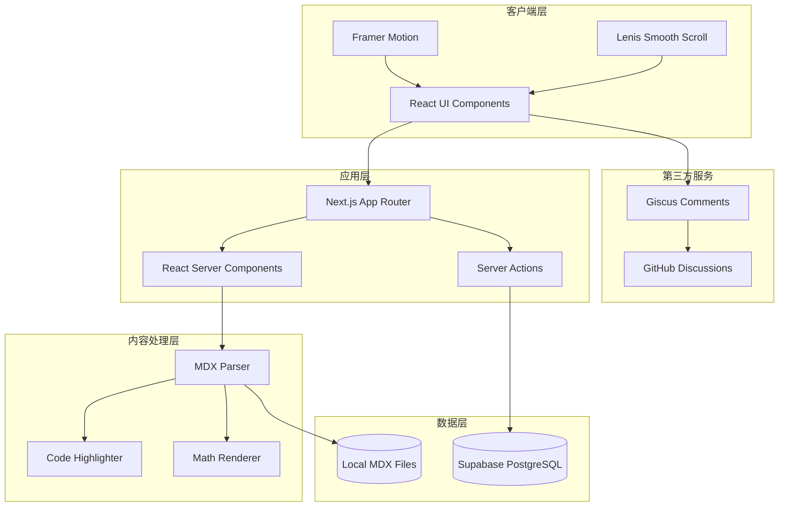

# 技术设计文档

## Overview

本设计文档描述了一个基于 Next.js 15 的现代化开发者博客与作品集网站的技术架构。系统采用 App Router 架构，集成了 MDX 内容管理、Supabase 数据库、Giscus 评论系统，并提供了丰富的视觉效果（平滑滚动、暗黑模式、毛玻璃效果、动画）。

核心技术栈：

- Next.js 15 (App Router) + React 19 + TypeScript
- Tailwind CSS v4 + shadcn/ui
- MDX (next-mdx-remote) + Shiki + KaTeX
- Framer Motion + Lenis
- Supabase (PostgreSQL + Auth)
- Giscus (GitHub Discussions)

系统架构遵循关注点分离原则，将内容解析、样式系统、数据持久化、用户交互等功能模块化，确保可维护性和可扩展性。

## Architecture

### 系统架构图



### 架构层次

1. **客户端层**：负责用户界面渲染、动画效果和平滑滚动
2. **应用层**：Next.js App Router 处理路由、服务端渲染和服务端操作
3. **内容处理层**：解析 MDX 内容、代码高亮、数学公式渲染
4. **数据层**：Supabase 数据库存储结构化数据，本地文件系统存储 MDX 内容
5. **第三方服务**：Giscus 评论系统集成

### 数据流

1. **内容渲染流程**：
   - 用户请求页面 → App Router 路由 → RSC 读取 MDX 文件 → MDX Parser 解析 → Shiki/KaTeX 处理 → 渲染 HTML

2. **交互数据流程**：
   - 用户操作 → Client Component → Server Action → Supabase → 返回结果 → 更新 UI

3. **评论系统流程**：
   - 用户评论 → Giscus Component → GitHub API → GitHub Discussions → 显示评论

## Components and Interfaces

### 核心组件

#### 1. Layout Components

**RootLayout** (`app/layout.tsx`)

```typescript
interface RootLayoutProps {
  children: React.ReactNode;
}

// 全局布局组件，注入 Lenis 平滑滚动和全局样式
export default function RootLayout({ children }: RootLayoutProps): JSX.Element
```

**SmoothScrollProvider** (`components/smooth-scroll-provider.tsx`)

```typescript
interface SmoothScrollProviderProps {
  children: React.ReactNode;
}

// 客户端组件，初始化和管理 Lenis 实例
export function SmoothScrollProvider({ children }: SmoothScrollProviderProps): JSX.Element
```

#### 2. Content Components

**MDXContent** (`components/mdx-content.tsx`)

```typescript
interface MDXContentProps {
  source: MDXRemoteSerializeResult;
  components?: MDXComponents;
}

// 渲染解析后的 MDX 内容
export function MDXContent({ source, components }: MDXContentProps): JSX.Element
```

**CodeBlock** (`components/code-block.tsx`)

```typescript
interface CodeBlockProps {
  code: string;
  language: string;
  theme?: string;
}

// 使用 Shiki 高亮代码块
export function CodeBlock({ code, language, theme }: CodeBlockProps): JSX.Element
```

#### 3. Layout Components

**BentoGrid** (`components/bento-grid.tsx`)

```typescript
interface BentoGridProps {
  children: React.ReactNode;
  className?: string;
}

interface BentoCardProps {
  title: string;
  description?: string;
  size?: 'small' | 'medium' | 'large';
  children?: React.ReactNode;
  className?: string;
}

export function BentoGrid({ children, className }: BentoGridProps): JSX.Element
export function BentoCard({ title, description, size, children, className }: BentoCardProps): JSX.Element
```

#### 4. Comment Components

**GiscusComments** (`components/giscus-comments.tsx`)

```typescript
interface GiscusCommentsProps {
  repo: string;
  repoId: string;
  category: string;
  categoryId: string;
  mapping?: 'pathname' | 'url' | 'title';
  theme?: string;
}

// 集成 Giscus 评论系统
export function GiscusComments(props: GiscusCommentsProps): JSX.Element
```

### 工具函数接口

#### MDX Processing

**getMDXContent** (`lib/mdx.ts`)

```typescript
interface MDXFrontmatter {
  title: string;
  date: string;
  description?: string;
  tags?: string[];
  author?: string;
}

interface MDXContent {
  frontmatter: MDXFrontmatter;
  content: MDXRemoteSerializeResult;
}

// 读取并解析 MDX 文件
export async function getMDXContent(slug: string): Promise<MDXContent>

// 获取所有 MDX 文件列表
export async function getAllMDXSlugs(): Promise<string[]>
```

#### Supabase Client

**createClient** (`lib/supabase/client.ts`)

```typescript
import { createClient as createSupabaseClient } from '@supabase/supabase-js';

// 创建 Supabase 客户端实例
export function createClient(): SupabaseClient
```

**Server Actions** (`app/actions/reactions.ts`)

```typescript
interface ReactionData {
  postId: string;
  userId: string;
  type: 'like' | 'love' | 'fire';
}

// 添加反应
export async function addReaction(data: ReactionData): Promise<{ success: boolean; error?: string }>

// 获取文章反应统计
export async function getReactionStats(postId: string): Promise<Record<string, number>>
```

## Data Models

### Supabase 数据库模型

#### Posts Table

```sql
CREATE TABLE posts (
  id UUID PRIMARY KEY DEFAULT gen_random_uuid(),
  slug TEXT UNIQUE NOT NULL,
  title TEXT NOT NULL,
  description TEXT,
  content TEXT,
  published_at TIMESTAMP WITH TIME ZONE,
  updated_at TIMESTAMP WITH TIME ZONE DEFAULT NOW(),
  author_id UUID REFERENCES auth.users(id),
  tags TEXT[],
  view_count INTEGER DEFAULT 0,
  created_at TIMESTAMP WITH TIME ZONE DEFAULT NOW()
);

CREATE INDEX idx_posts_slug ON posts(slug);
CREATE INDEX idx_posts_published_at ON posts(published_at DESC);
CREATE INDEX idx_posts_tags ON posts USING GIN(tags);
```

#### Reactions Table

```sql
CREATE TABLE reactions (
  id UUID PRIMARY KEY DEFAULT gen_random_uuid(),
  post_id UUID REFERENCES posts(id) ON DELETE CASCADE,
  user_id UUID REFERENCES auth.users(id) ON DELETE CASCADE,
  type TEXT NOT NULL CHECK (type IN ('like', 'love', 'fire')),
  created_at TIMESTAMP WITH TIME ZONE DEFAULT NOW(),
  UNIQUE(post_id, user_id, type)
);

CREATE INDEX idx_reactions_post_id ON reactions(post_id);
CREATE INDEX idx_reactions_user_id ON reactions(user_id);
```

#### Projects Table (作品集)

```sql
CREATE TABLE projects (
  id UUID PRIMARY KEY DEFAULT gen_random_uuid(),
  slug TEXT UNIQUE NOT NULL,
  title TEXT NOT NULL,
  description TEXT,
  image_url TEXT,
  demo_url TEXT,
  github_url TEXT,
  tags TEXT[],
  featured BOOLEAN DEFAULT FALSE,
  display_order INTEGER,
  created_at TIMESTAMP WITH TIME ZONE DEFAULT NOW(),
  updated_at TIMESTAMP WITH TIME ZONE DEFAULT NOW()
);

CREATE INDEX idx_projects_slug ON projects(slug);
CREATE INDEX idx_projects_featured ON projects(featured) WHERE featured = TRUE;
CREATE INDEX idx_projects_display_order ON projects(display_order);
```

### Row Level Security (RLS) 策略

```sql
-- Posts 表 RLS
ALTER TABLE posts ENABLE ROW LEVEL SECURITY;

-- 所有人可以读取已发布的文章
CREATE POLICY "Public posts are viewable by everyone"
  ON posts FOR SELECT
  USING (published_at IS NOT NULL AND published_at <= NOW());

-- 只有作者可以插入、更新、删除自己的文章
CREATE POLICY "Authors can insert their own posts"
  ON posts FOR INSERT
  WITH CHECK (auth.uid() = author_id);

CREATE POLICY "Authors can update their own posts"
  ON posts FOR UPDATE
  USING (auth.uid() = author_id);

CREATE POLICY "Authors can delete their own posts"
  ON posts FOR DELETE
  USING (auth.uid() = author_id);

-- Reactions 表 RLS
ALTER TABLE reactions ENABLE ROW LEVEL SECURITY;

-- 所有人可以查看反应
CREATE POLICY "Reactions are viewable by everyone"
  ON reactions FOR SELECT
  USING (true);

-- 认证用户可以添加反应
CREATE POLICY "Authenticated users can add reactions"
  ON reactions FOR INSERT
  WITH CHECK (auth.uid() = user_id);

-- 用户只能删除自己的反应
CREATE POLICY "Users can delete their own reactions"
  ON reactions FOR DELETE
  USING (auth.uid() = user_id);

-- Projects 表 RLS
ALTER TABLE projects ENABLE ROW LEVEL SECURITY;

-- 所有人可以查看项目
CREATE POLICY "Projects are viewable by everyone"
  ON projects FOR SELECT
  USING (true);

-- 只有管理员可以管理项目（需要自定义函数判断）
CREATE POLICY "Admins can manage projects"
  ON projects FOR ALL
  USING (auth.uid() IN (SELECT id FROM auth.users WHERE email = 'admin@example.com'));
```

### MDX Frontmatter 数据模型

```typescript
interface BlogPostFrontmatter {
  title: string;              // 文章标题
  date: string;               // 发布日期 (ISO 8601)
  description?: string;       // 文章描述
  tags?: string[];            // 标签数组
  author?: string;            // 作者名称
  coverImage?: string;        // 封面图片 URL
  draft?: boolean;            // 是否为草稿
}

interface ProjectFrontmatter {
  title: string;              // 项目标题
  description: string;        // 项目描述
  image: string;              // 项目图片
  demoUrl?: string;           // 演示链接
  githubUrl?: string;         // GitHub 链接
  tags: string[];             // 技术标签
  featured?: boolean;         // 是否为精选项目
}
```

### 文件系统结构

```
content/
├── blog/
│   ├── post-1.mdx
│   ├── post-2.mdx
│   └── ...
└── projects/
    ├── project-1.mdx
    ├── project-2.mdx
    └── ...
```

## Correctness Properties

*属性（Property）是指在系统所有有效执行中都应该成立的特征或行为——本质上是关于系统应该做什么的形式化陈述。属性是人类可读规范和机器可验证正确性保证之间的桥梁。*

### Property 1: Markdown 语法解析完整性

*对于任何*标准 Markdown 语法元素（标题、列表、链接、图片、引用、代码块等），MDX 解析器应该将其正确转换为对应的 HTML 结构。

**Validates: Requirements 5.2**

### Property 2: Frontmatter 提取一致性

*对于任何*包含 YAML frontmatter 的 MDX 文件，解析器应该正确提取所有元数据字段，并且提取后的数据类型应该与原始 YAML 定义一致。

**Validates: Requirements 5.4**

### Property 3: 代码高亮应用普遍性

*对于任何*在 MDX 中标记了语言的代码块，代码高亮器应该自动应用语法高亮，并且输出的 HTML 应该包含语法高亮的样式类。

**Validates: Requirements 6.4**

### Property 4: 代码格式保留不变性

*对于任何*代码字符串，经过语法高亮处理后，其中的空白字符（空格、制表符、换行符）和缩进结构应该与原始代码完全一致。

**Validates: Requirements 6.5**

### Property 5: LaTeX 公式渲染完整性

*对于任何*有效的 LaTeX 数学公式语法（行内公式 `$...$` 或块级公式 `$$...$$`），数学渲染器应该将其转换为可视化的 HTML 数学公式元素。

**Validates: Requirements 7.5**

### Property 6: Bento 卡片样式一致性

*对于任何* Bento Grid 中的卡片组件，渲染后的 DOM 元素应该包含圆角样式类和边框样式类，确保视觉一致性。

**Validates: Requirements 8.2, 8.3**

### Property 7: 文本对比度可访问性

*对于任何*文本元素和其背景色的组合，颜色对比度应该满足 WCAG AA 标准（至少 4.5:1 for 正常文本，3:1 for 大文本），确保在暗黑模式下的可读性。

**Validates: Requirements 9.4**

### Property 8: 交互元素悬停状态完整性

*对于任何*交互元素（按钮、链接、卡片等），应该定义暗黑模式下的悬停状态样式，确保用户交互反馈的一致性。

**Validates: Requirements 9.5**

### Property 9: 交互元素动画响应性

*对于任何*交互元素，当触发悬停事件时，应该执行定义的动画过渡效果，提供流畅的用户体验。

**Validates: Requirements 11.5**

### Property 10: 博客文章评论区存在性

*对于任何*博客文章详情页面，页面 DOM 结构中应该包含 Giscus 评论组件，确保所有文章都支持评论功能。

**Validates: Requirements 12.3**

### Property 11: 触摸目标尺寸可访问性

*对于任何*交互元素，其可点击区域的最小尺寸应该不小于 44x44 像素（CSS 像素），确保在触摸屏设备上易于操作。

**Validates: Requirements 14.5**

## Error Handling

### MDX 解析错误

**场景**：MDX 文件格式错误或包含无效语法

**处理策略**：

- 捕获解析异常并记录详细错误信息（文件路径、行号、错误类型）
- 在开发环境显示友好的错误页面，包含错误堆栈
- 在生产环境返回通用的 404 页面，避免暴露系统细节
- 使用 TypeScript 类型守卫验证 frontmatter 数据结构

```typescript
try {
  const { frontmatter, content } = await getMDXContent(slug);
  // 验证 frontmatter 必需字段
  if (!frontmatter.title || !frontmatter.date) {
    throw new Error('Missing required frontmatter fields');
  }
} catch (error) {
  console.error(`Failed to parse MDX file: ${slug}`, error);
  notFound(); // Next.js 404 处理
}
```

### Supabase 连接错误

**场景**：数据库连接失败或查询超时

**处理策略**：

- 实现重试机制（最多 3 次，指数退避）
- 设置合理的查询超时时间（5 秒）
- 捕获 Supabase 错误并返回标准化的错误响应
- 在客户端显示友好的错误提示，允许用户重试

```typescript
export async function getReactionStats(postId: string) {
  try {
    const { data, error } = await supabase
      .from('reactions')
      .select('type, count')
      .eq('post_id', postId)
      .timeout(5000);
    
    if (error) throw error;
    return { success: true, data };
  } catch (error) {
    console.error('Failed to fetch reaction stats:', error);
    return { success: false, error: 'Failed to load reactions' };
  }
}
```

### 代码高亮错误

**场景**：Shiki 不支持的编程语言或高亮器初始化失败

**处理策略**：

- 对于不支持的语言，回退到纯文本显示（保留代码块样式）
- 预加载常用语言的语法定义，减少运行时加载失败
- 捕获高亮错误并记录，但不阻塞页面渲染

```typescript
async function highlightCode(code: string, lang: string) {
  try {
    const highlighter = await getHighlighter({ theme: 'github-dark' });
    return highlighter.codeToHtml(code, { lang });
  } catch (error) {
    console.warn(`Failed to highlight code for language: ${lang}`, error);
    // 回退到纯文本
    return `<pre><code>${escapeHtml(code)}</code></pre>`;
  }
}
```

### 数学公式渲染错误

**场景**：无效的 LaTeX 语法导致 KaTeX 渲染失败

**处理策略**：

- 配置 KaTeX 的 `throwOnError: false` 选项，避免渲染错误中断页面
- 在公式渲染失败时显示原始 LaTeX 代码
- 在开发环境的控制台输出详细的 KaTeX 错误信息

```typescript
const rehypeKatexOptions = {
  throwOnError: false,
  errorColor: '#cc0000',
  strict: 'warn'
};
```

### 第三方服务错误

**场景**：Giscus 评论系统加载失败或 GitHub API 不可用

**处理策略**：

- 使用 React Error Boundary 捕获评论组件的渲染错误
- 显示降级 UI："评论系统暂时不可用，请稍后再试"
- 不阻塞页面其他部分的正常显示
- 实现客户端重试按钮

```typescript
<ErrorBoundary fallback={<CommentErrorFallback />}>
  <GiscusComments {...config} />
</ErrorBoundary>
```

### 文件系统错误

**场景**：MDX 文件不存在或读取权限不足

**处理策略**：

- 在构建时验证所有 MDX 文件的存在性
- 运行时捕获文件读取错误并返回 404
- 记录文件系统错误日志，便于调试

## Testing Strategy

### 测试方法概述

本项目采用**双重测试策略**，结合单元测试和基于属性的测试（Property-Based Testing, PBT），确保全面的代码覆盖和正确性验证。

- **单元测试**：验证特定示例、边缘情况和错误条件
- **属性测试**：验证跨所有输入的通用属性，通过随机化输入发现潜在问题

两种测试方法互补：单元测试捕获具体的 bug，属性测试验证通用的正确性。

### 测试工具选择

- **测试框架**：Vitest（与 Next.js 和 TypeScript 良好集成）
- **React 测试**：React Testing Library
- **属性测试库**：fast-check（JavaScript/TypeScript 的 PBT 库）
- **E2E 测试**：Playwright（用于关键用户流程）

### 单元测试策略

单元测试专注于：

1. **具体示例**：验证特定输入产生预期输出
2. **边缘情况**：空输入、极大值、特殊字符等
3. **错误条件**：无效输入、网络错误、解析失败等
4. **集成点**：组件间交互、API 调用、数据库查询

**示例：MDX 解析单元测试**

```typescript
describe('getMDXContent', () => {
  it('should parse valid MDX file with frontmatter', async () => {
    const result = await getMDXContent('test-post');
    expect(result.frontmatter.title).toBe('Test Post');
    expect(result.content).toBeDefined();
  });

  it('should throw error for non-existent file', async () => {
    await expect(getMDXContent('non-existent')).rejects.toThrow();
  });

  it('should handle empty frontmatter gracefully', async () => {
    const result = await getMDXContent('no-frontmatter');
    expect(result.frontmatter).toEqual({});
  });
});
```

### 属性测试策略

属性测试配置：

- **最小迭代次数**：每个属性测试运行 100 次（通过随机输入）
- **标签格式**：每个测试必须引用设计文档中的属性
  - 格式：`Feature: developer-portfolio-blog, Property {number}: {property_text}`

**属性测试示例**

**Property 1: Markdown 语法解析完整性**

```typescript
import fc from 'fast-check';

describe('Property 1: Markdown syntax parsing completeness', () => {
  it('should parse all standard Markdown elements correctly', async () => {
    // Feature: developer-portfolio-blog, Property 1: Markdown 语法解析完整性
    
    await fc.assert(
      fc.asyncProperty(
        fc.oneof(
          fc.string().map(s => `# ${s}`), // 标题
          fc.array(fc.string()).map(arr => arr.map(s => `- ${s}`).join('\n')), // 列表
          fc.tuple(fc.string(), fc.webUrl()).map(([text, url]) => `[${text}](${url})`), // 链接
        ),
        async (markdown) => {
          const result = await parseMDX(markdown);
          // 验证解析结果包含对应的 HTML 标签
          expect(result).toContain('<'); // 至少包含 HTML 标签
          expect(result).not.toContain('undefined');
        }
      ),
      { numRuns: 100 }
    );
  });
});
```

**Property 4: 代码格式保留不变性**

```typescript
describe('Property 4: Code format preservation', () => {
  it('should preserve whitespace and indentation in code', async () => {
    // Feature: developer-portfolio-blog, Property 4: 代码格式保留不变性
    
    await fc.assert(
      fc.asyncProperty(
        fc.string().filter(s => s.includes(' ') || s.includes('\t') || s.includes('\n')),
        fc.constantFrom('javascript', 'python', 'typescript', 'rust'),
        async (code, lang) => {
          const highlighted = await highlightCode(code, lang);
          // 提取高亮后的纯文本内容
          const extractedCode = stripHtmlTags(highlighted);
          // 验证空白字符完全一致
          expect(extractedCode).toBe(code);
        }
      ),
      { numRuns: 100 }
    );
  });
});
```

**Property 6: Bento 卡片样式一致性**

```typescript
describe('Property 6: Bento card style consistency', () => {
  it('should apply rounded corners and borders to all cards', () => {
    // Feature: developer-portfolio-blog, Property 6: Bento 卡片样式一致性
    
    fc.assert(
      fc.property(
        fc.string(), // title
        fc.option(fc.string()), // description
        fc.constantFrom('small', 'medium', 'large'), // size
        (title, description, size) => {
          const { container } = render(
            <BentoCard title={title} description={description} size={size} />
          );
          const card = container.firstChild as HTMLElement;
          
          // 验证包含圆角和边框样式类
          const classes = card.className;
          expect(classes).toMatch(/rounded/);
          expect(classes).toMatch(/border/);
        }
      ),
      { numRuns: 100 }
    );
  });
});
```

**Property 11: 触摸目标尺寸可访问性**

```typescript
describe('Property 11: Touch target size accessibility', () => {
  it('should ensure all interactive elements meet minimum size', () => {
    // Feature: developer-portfolio-blog, Property 11: 触摸目标尺寸可访问性
    
    fc.assert(
      fc.property(
        fc.string(), // button text
        fc.constantFrom('button', 'link', 'card'),
        (text, elementType) => {
          let element;
          if (elementType === 'button') {
            element = render(<Button>{text}</Button>);
          } else if (elementType === 'link') {
            element = render(<Link href="#">{text}</Link>);
          } else {
            element = render(<BentoCard title={text} />);
          }
          
          const node = element.container.firstChild as HTMLElement;
          const rect = node.getBoundingClientRect();
          
          // 验证最小尺寸 44x44px
          expect(rect.width).toBeGreaterThanOrEqual(44);
          expect(rect.height).toBeGreaterThanOrEqual(44);
        }
      ),
      { numRuns: 100 }
    );
  });
});
```

### 集成测试

**Supabase 集成测试**：

- 使用 Supabase 本地开发环境或测试数据库
- 测试 CRUD 操作和 RLS 策略
- 验证 Server Actions 的正确性

```typescript
describe('Reaction Server Actions', () => {
  it('should add reaction and update stats', async () => {
    const postId = 'test-post-id';
    const userId = 'test-user-id';
    
    await addReaction({ postId, userId, type: 'like' });
    const stats = await getReactionStats(postId);
    
    expect(stats.like).toBe(1);
  });
});
```

### E2E 测试

使用 Playwright 测试关键用户流程：

1. **博客浏览流程**：
   - 访问首页 → 点击博客文章 → 验证内容渲染 → 滚动到评论区

2. **平滑滚动验证**：
   - 验证 Lenis 初始化 → 触发滚动 → 验证平滑效果

3. **响应式布局**：
   - 在不同视口尺寸下验证布局正确性

```typescript
test('blog post reading flow', async ({ page }) => {
  await page.goto('/');
  await page.click('text=Read More');
  
  // 验证 MDX 内容渲染
  await expect(page.locator('article')).toBeVisible();
  
  // 验证代码高亮
  await expect(page.locator('pre code.shiki')).toBeVisible();
  
  // 验证评论区
  await page.evaluate(() => window.scrollTo(0, document.body.scrollHeight));
  await expect(page.locator('.giscus')).toBeVisible();
});
```

### 测试覆盖率目标

- **单元测试覆盖率**：≥ 80%（核心业务逻辑）
- **属性测试覆盖率**：所有 Correctness Properties 必须有对应的属性测试
- **E2E 测试覆盖率**：覆盖所有关键用户流程

### 持续集成

- 在 GitHub Actions 中运行所有测试
- Pull Request 必须通过所有测试才能合并
- 每日运行完整的 E2E 测试套件
